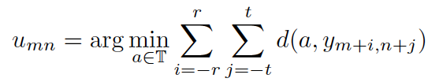
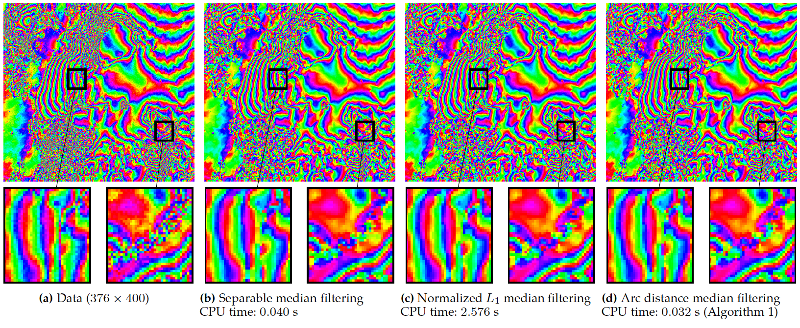
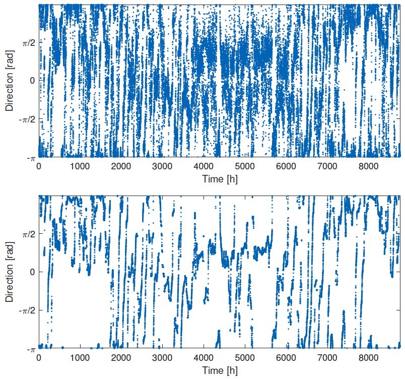

# Circle median filter toolbox (CMF)
 
This toolbox contains a fast algorithm for median filtering of signals and images with values on the unit circle, for example phase or orientation data.
The (arc distance) median filter for an image y with values on the unit circle is given by 

where d denotes the arc distance length of two angles, and r, t are the horizontal and vertical "radii" of the filter mask.

The code is a reference implementation (in C++ with Matlab wrappers) of the algorithms described in the paper:

Martin Storath, Andreas Weinmann.
[Fast median filtering for phase or orientation data.](https://doi.org/10.1109/TPAMI.2017.2692779)
IEEE Transactions on Pattern Analysis and Machine Intelligence, 2017 (in press, [preprint](https://hci.iwr.uni-heidelberg.de/sites/default/files/profiles/mstorath/files/storath2017fast.pdf))

### Example

*Left:* A circle-valued image, i.e. every pixel takes its value on the unit circle (or in angular representation a value in (-pi, pi]). The values are visualized as hue component in the HSV color space.
*Right:* Effect of the circle-median filter using a filter mask of size 7 × 7. 

### Applications

- Smoothing of phase data, e.g. interferometric SAR images
   
- Smoothing of orientation data, e.g. wind directions

   
   
- Smoothing of vector fields in polar coordinates, e.g. optical flow images

### Contents
- demos:     some demos, self explanatory (implemented in Matlab)
- auxiliary: some useful helper functions (implemented in Matlab)
- filters:   the fast algorithms for median filtering of circle valued data 
(implemented in C++ with Matlab wrappers)

### Installation and usage

- From Matlab: Run CMF_install.m in the Matlab console and follow the demos 
- From C++: Compile CMF_library.cpp. The relevant functions are medfiltCirc2D and medfiltCirc2DQuant. Their usage is described as comment in the CMF_library.cpp file.

