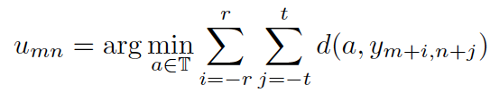
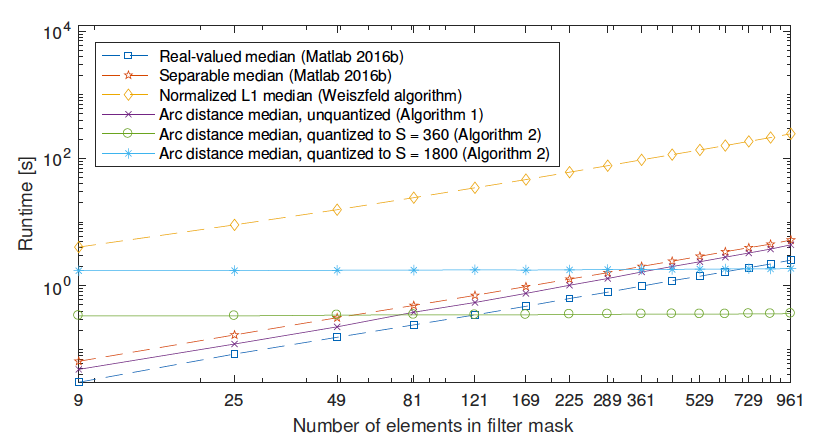
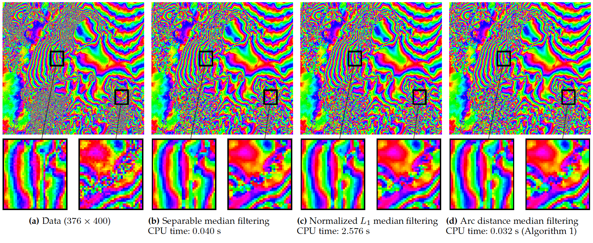
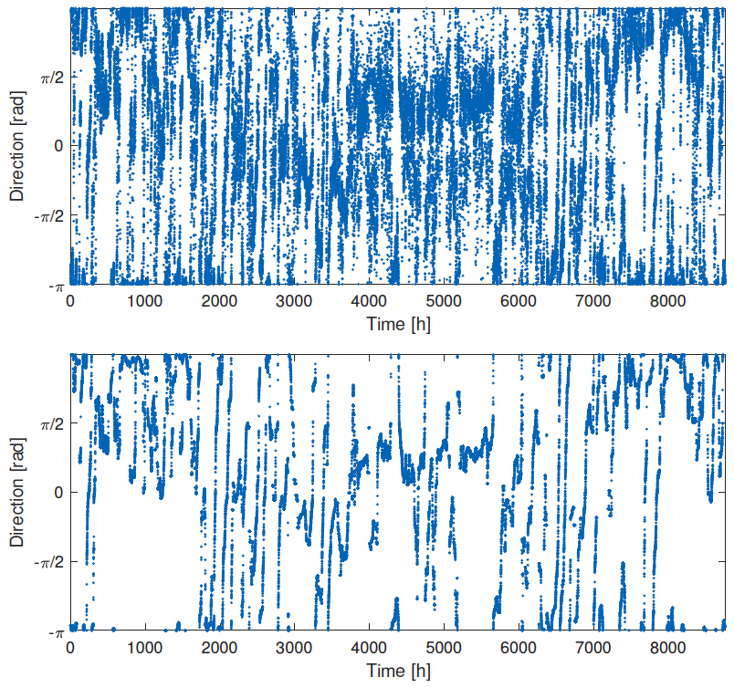

# CircleMedianFilter (CMF) — Fast median filtering for phase or orientation data

[](https://pypi.org/project/pycirclemedianfilter/)
[](https://pypi.org/project/pycirclemedianfilter/)
[](LICENSE)
[](#matlab)
[](https://de.mathworks.com/matlabcentral/fileexchange/62509-circle-median-filter)

A fast median filter for signals and images whose values lie on the unit circle (phase, orientation, interferometric SAR, wind directions, optical-flow angles). Linear in filter mask size for non-quantised data, constant for quantised data.


*Left:* A circle-valued image — every pixel takes its value on the unit circle (or in angular representation a value in (-π, π]), visualised as the hue component in the HSV colour space. *Right:* Effect of the circle-median filter using a 7 × 7 mask.

The (arc distance) median filter for an image y with values on the unit circle is given by



where d denotes the arc distance length of two angles, and r, t are the horizontal and vertical "radii" of the filter mask.

## Paper

> M. Storath, A. Weinmann.
> [*Fast median filtering for phase or orientation data.*](https://doi.org/10.1109/TPAMI.2017.2692779)
> IEEE Transactions on Pattern Analysis and Machine Intelligence, 40(3):639–652, 2018.
> [preprint](https://hci.iwr.uni-heidelberg.de/sites/default/files/profiles/mstorath/files/storath2017fast.pdf)

## Quickstart

### Python

```bash
pip install pycirclemedianfilter
```

Input arrays are accepted in either C-order or Fortran-order (since v0.1.7 the binding auto-converts as needed). Outputs are Fortran-strided. See [`demos_python/`](demos_python/) for examples.

### MATLAB

- Run `CMF_install.m` in the MATLAB console and follow the demos in [`demos_matlab/`](demos_matlab/).

### C++

- Compile `CMF_library.cpp`. The relevant functions are `medfiltCirc2D` and `medfiltCirc2DQuant`. Their usage is documented as comments in `CMF_library.cpp`.

## Runtime comparison

Time complexity with respect to filter mask size is

- linear for non-quantised data,
- constant for quantised data.



## Applications

- Smoothing of phase data, e.g. interferometric SAR images

   

- Smoothing of orientation data, e.g. wind directions

   

- Smoothing of vector fields in polar coordinates, e.g. optical-flow images.

## Updates

- 2025/02/18: Added Python bindings for the core C++ filtering code.

## Contents

- `demos_matlab/` — MATLAB demos
- `demos_python/` — Python demos
- `auxiliary/` — helper functions (MATLAB)
- `filters/` — the fast algorithms for median filtering of circle-valued data (C++ with MATLAB wrappers)

## How to cite

If you use this software, please cite the paper above. GitHub's "Cite this repository" button on the repo page reads the `version` and `date-released` fields from [`CITATION.cff`](CITATION.cff) and renders BibTeX/APA.

## Selected user applications

- S. Quan et al. *Derivation of the orientation parameters in built-up areas: with application to model-based decomposition.* IEEE Transactions on Geoscience and Remote Sensing, 2018.
- H. Salmane et al. *A method for the automated detection of solar radio bursts in dynamic spectra.* J. Space Weather Space Clim. 2018.
- B. Guo, J. Wen, Y. Han. *Deep material recognition in light-fields via disentanglement of spatial and angular information.* ECCV 2020.

## See also

Sibling projects from the same research program on variational methods for signal and image processing:

- [Pottslab](https://github.com/mstorath/Pottslab) — multilabel image segmentation via the Potts / piecewise-constant Mumford-Shah model
- [L1TV](https://github.com/mstorath/L1TV) — exact L1-TV regularisation of real- or circle-valued signals
- [CSSD](https://github.com/mstorath/CSSD) — cubic smoothing splines for signals with discontinuities
- [MumfordShah2D](https://github.com/mstorath/MumfordShah2D) — edge-preserving image restoration via the Mumford-Shah model
- [DCEBE](https://github.com/mstorath/DCEBE) — bolus arrival time estimation for DCE-MRI signals

## License

Released under the MIT License. See [LICENSE](LICENSE).
